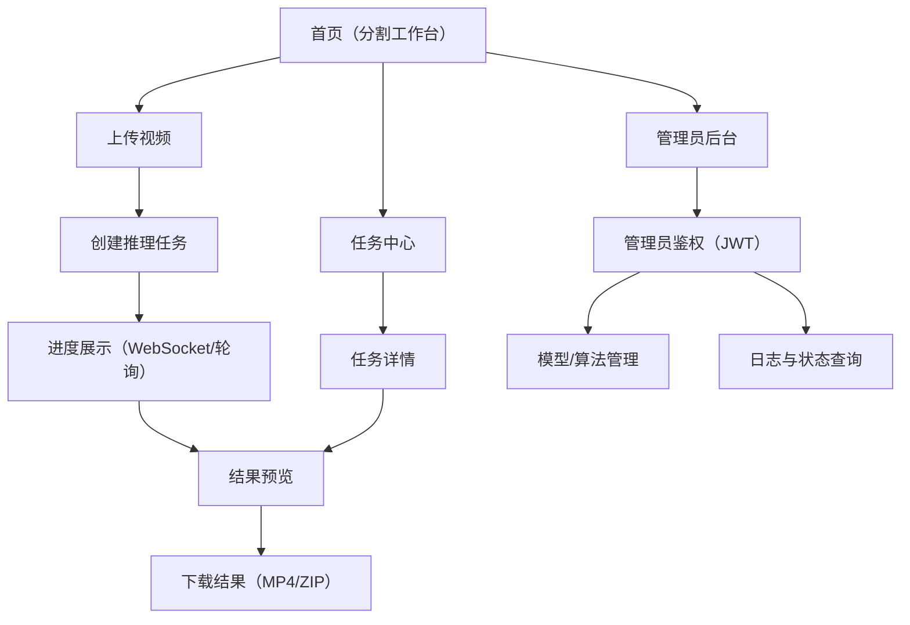

## 1. Product Overview
视频发声物体分割系统（AVS System）通过融合音频与视觉信息，对视频中“正在发声”的目标进行像素级分割。
面向需要快速获取分割结果的终端用户与负责模型/系统维护的管理员，提供上传、推理、可视化对比与结果下载能力。

## 2. Core Features

### 2.1 User Roles
| 角色 | 注册/登录方式 | 核心权限 |
|------|----------------|----------|
| 普通用户 | 无需登录（公开使用） | 上传视频、选择算法、启动/取消任务、查看进度、预览与下载结果、查看历史任务 |
| 管理员 | 管理员鉴权（JWT Token） | 上传/切换/删除模型权重、维护算法元数据、查询系统日志与状态 |

### 2.2 Feature Module
本产品由以下核心页面组成：
1. **首页（分割工作台）**：视频上传、算法选择、启动/取消任务、进度展示、结果可视化（对比/叠加/逐帧）、下载入口。
2. **任务中心**：历史任务列表、任务详情（状态/进度/错误信息）、结果再次预览与下载。
3. **管理员后台**：管理员鉴权入口、模型权重管理、算法元数据管理、日志与系统状态查询。

### 2.3 Page Details
| Page Name | Module Name | Feature description |
|-----------|-------------|---------------------|
| 首页（分割工作台） | 视频上传 | 校验并上传单个视频文件（mp4/avi/mov/mkv；≤2GB），返回文件标识。 |
| 首页（分割工作台） | 算法选择与启动 | 选择 AVSegFormer/VCT/COMBO；发起任务创建；任务运行中按钮置灰并显示加载状态。 |
| 首页（分割工作台） | 进度与取消 | 展示 0–100% 进度条；接收实时推送或轮询；支持取消任务并在短时间内生效。 |
| 首页（分割工作台） | 结果预览 | 支持左右分屏同步播放；支持掩码叠加与透明度调节；支持播放控制与倍速；支持逐帧浏览。 |
| 首页（分割工作台） | 结果下载 | 任务完成后提供下载结果视频（MP4）与逐帧掩码（ZIP）。 |
| 任务中心 | 历史任务列表 | 列表展示已完成任务的缩略图/算法/处理时间/状态；进入任务详情。 |
| 任务中心 | 任务详情 | 查询任务状态、进度与失败原因；支持再次预览与下载。 |
| 管理员后台 | 管理员鉴权 | 录入/刷新 JWT Token；对 /api/admin/* 的访问进行授权控制。 |
| 管理员后台 | 模型权重管理 | 上传 .pth 权重并注册；对模型版本进行激活/禁用/删除。 |
| 管理员后台 | 算法元数据管理 | 编辑算法名称、版本、适用场景描述、输入尺寸要求。 |
| 管理员后台 | 日志与状态 | 按时间/类型/任务状态筛选查询日志；查看耗时、显存峰值、异常（如 OOM/格式不支持）。 |

## 3. Core Process
**普通用户流程**：在首页上传视频 → 选择算法 → 启动任务 → 实时查看进度（可取消）→ 完成后进行对比/叠加/逐帧预览 → 下载结果视频或掩码 ZIP → 在任务中心查看历史与再次下载。

**管理员流程**：进入管理员后台 → 完成鉴权 → 上传/切换/删除模型权重并维护算法描述 → 查询系统日志与健康状态。

