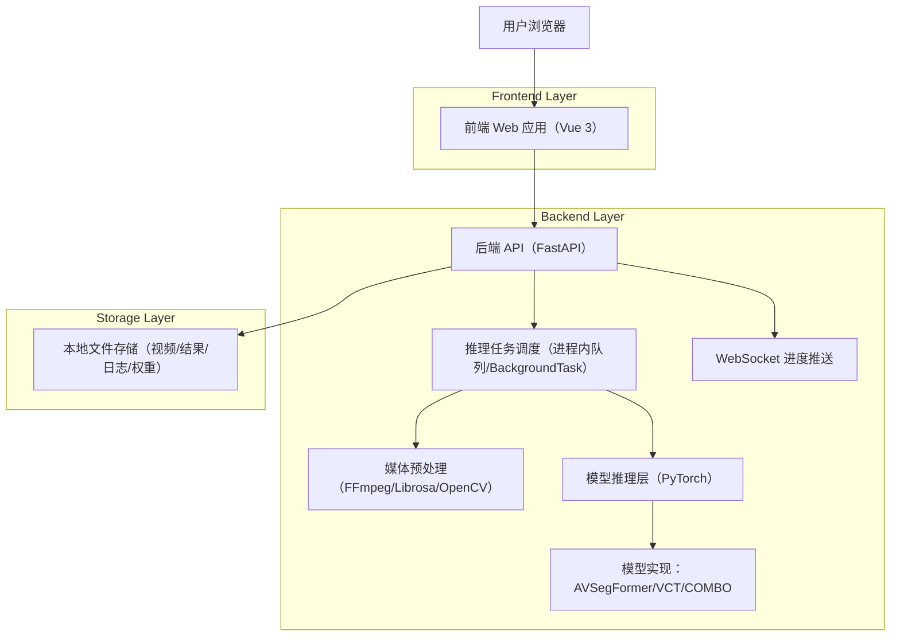
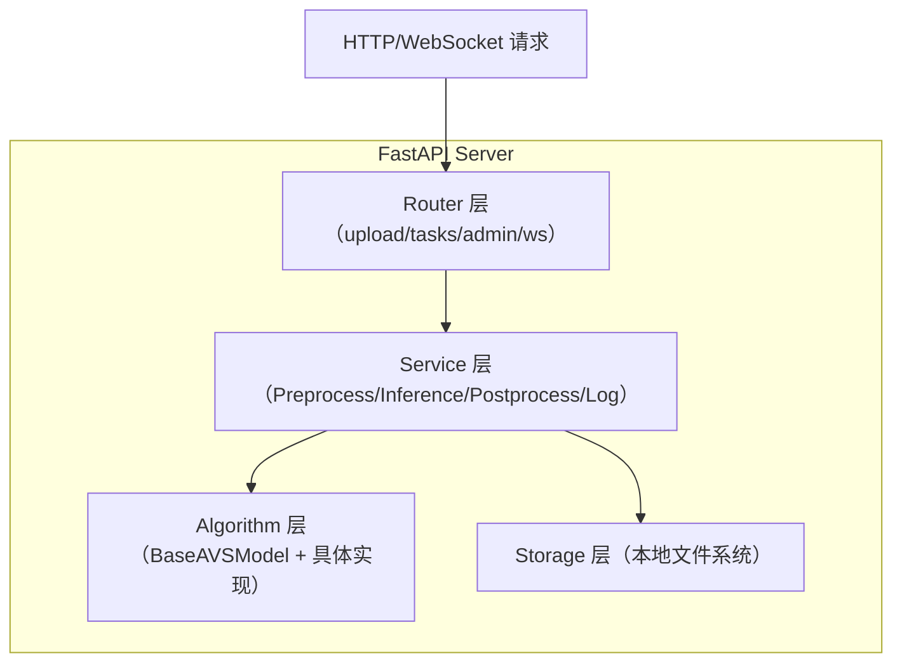

## 1.Architecture design


## 2.Technology Description
- Frontend: Vue@3 + Vite + Element Plus + Pinia + Axios + WebSocket
- Backend: Python@3.8+ + FastAPI + Uvicorn
- Algorithm/Media: PyTorch@2.x + CUDA@11.8+ + FFmpeg + Librosa + OpenCV
- Database: None（任务与历史记录以本地 JSON/文件元数据持久化；权重与结果落盘）

## 3.Route definitions
| Route | Purpose |
|-------|---------|
| / | 首页工作台：上传、选算法、启动/取消、进度、预览、下载 |
| /tasks | 任务中心：历史任务列表 |
| /tasks/:taskId | 任务详情：状态/错误、预览、下载 |
| /admin | 管理员后台：鉴权、模型/算法元数据、日志与健康状态 |

## 4.API definitions (If it includes backend services)

### 4.1 Core API
文件上传与任务
- `POST /api/upload`：上传视频，返回 `file_id`
- `POST /api/tasks`：创建分割任务（file_id + algorithm），返回 `task_id`
- `GET /api/tasks/{task_id}`：查询状态与进度
- `DELETE /api/tasks/{task_id}`：取消并删除任务
- `GET /api/tasks/{task_id}/result`：下载/获取结果视频
- `GET /api/tasks/{task_id}/masks`：下载逐帧掩码 ZIP
- `GET /api/algorithms`：获取算法列表与描述
- `GET /api/health`：健康检查

管理员
- `POST /api/admin/models`：上传模型权重（.pth）并注册
- `GET /api/admin/logs`：查询系统日志（按时间/类型/状态筛选）

WebSocket
- `GET /ws/tasks/{task_id}/progress`：推送进度（current/total/progress）
- `GET /ws/tasks/{task_id}/status`：推送状态变更（running/completed/failed/canceled）

### 4.2 Shared TypeScript types（前后端对齐的数据契约）
```ts
export type AlgorithmId = "avsegformer" | "vct" | "combo";
export type TaskStatus = "queued" | "running" | "completed" | "failed" | "canceled";

export interface CreateTaskRequest {
  file_id: string;
  algorithm: AlgorithmId;
}

export interface TaskProgress {
  task_id: string;
  status: TaskStatus;
  progress: number; // 0-100
  current_frame?: number;
  total_frames?: number;
  message?: string; // 错误或提示
}

export interface AlgorithmInfo {
  id: AlgorithmId;
  name: string;
  version?: string;
  description: string;
  input_size?: "224x224" | "384x384" | string;
  enabled: boolean;
}
```

### 4.3 模型推理占位接口（后端策略模式）
> 用于在不改动调度核心的前提下接入/替换 AVSegFormer、VCT、COMBO。

```py
from typing import Protocol, List
import numpy as np

class InferenceRequest(Protocol):
    algorithm: str
    frames_dir: str
    audio_path: str

class InferenceResult(Protocol):
    masks_dir: str
    overlay_video_path: str
    report_path: str

class BaseAVSModel(Protocol):
    name: str
    def load_weights(self, weight_path: str, device: str) -> None: ...
    def infer(self, frames: List[np.ndarray], audio_features: np.ndarray) -> List[np.ndarray]: ...

class InferenceService:
    def run(self, req: InferenceRequest) -> InferenceResult:
        """占位：调度预处理→模型推理→后处理，并持续上报进度。"""
        raise NotImplementedError
```

## 5.Server architecture diagram (If it includes backend services)


## 6.Data model(if applicable)
本系统不引入独立数据库；任务历史、算法元数据与日志以文件形式持久化（如 `tasks/*.json`、`algorithms.json`、`logs/*.log`），视频/结果/权重按目录分层存储。